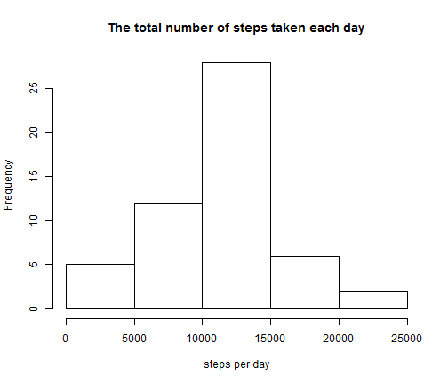
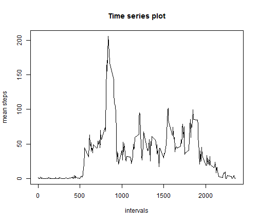
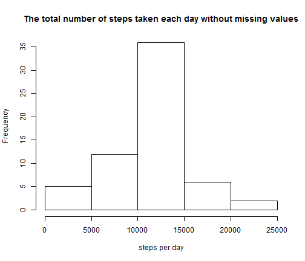
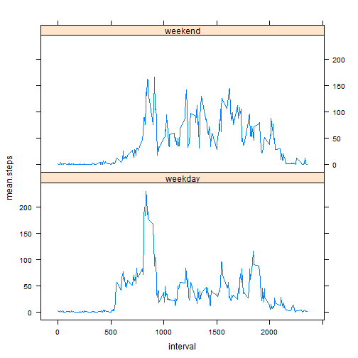
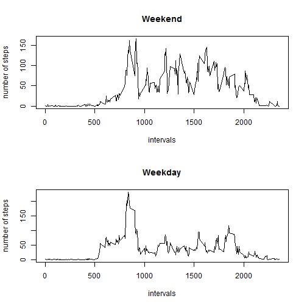

Project 1
========================================================

### Loading and preprocessing the data


```r
data <- read.csv("C:/Users/ppp/Documents/activity.csv", header = T)
head(data)
```

```
##   steps       date interval
## 1    NA 2012-10-01        0
## 2    NA 2012-10-01        5
## 3    NA 2012-10-01       10
## 4    NA 2012-10-01       15
## 5    NA 2012-10-01       20
## 6    NA 2012-10-01       25
```


### Q1: What is mean total number of steps taken per day?

**Making a histogram of the total number of steps taken each day.**  
**Calculating and reporting the mean and median total number of steps taken per day.**


```r
list1 <- split(data$steps, data$date)
totalsteps <- as.numeric(sapply(list1, sum))
hist(totalsteps, main = "The total number of steps taken each day", xlab = "steps per day")
```

 

```r
summary(totalsteps)
```

```
##    Min. 1st Qu.  Median    Mean 3rd Qu.    Max.    NA's 
##      41    8840   10800   10800   13300   21200       8
```


**From the above output, we find that the mean total number of steps taken per day is 10770.**
**The median total number of steps taken per day is 10760.**  
  
  
### Q2: What is the average daily activity pattern?

**Making a time series plot of the 5-minute interval (x-axis) and the average number of steps taken, averaged across all days (y-axis).**


```r
meansteps <- as.numeric(tapply(data$steps, data$interval, mean, na.rm = T))
interval <- as.numeric(unique(data$interval))
mean.data <- data.frame(mean.step = meansteps, interval = interval)
plot(mean.data[, 2], mean.data[, 1], type = "l", main = "Time series plot", 
    xlab = "intervals", ylab = "mean steps")
```

 

```r
mean.data[mean.data[, 1] == max(mean.data[, 1]), ]
```

```
##     mean.step interval
## 104     206.2      835
```


**5-minute interval "835", on average across all the days in the dataset, contains the maximum number of steps.**  


### Q3: Inputing Missing Values

**Note that there are a number of days/intervals where there are missing values (coded as NA). The presence of missing days may introduce bias into some calculations or summaries of the data.**   
**How many missing values are there in the dataset?**


```r
missing = numeric(3)
for (i in 1:3) {
    missing[i] <- sum(is.na(data[, i]) == TRUE)
}
sum(missing)
```

```
## [1] 2304
```


**There are 2304 missing values in the dataset.**    


**Using the mean for that 5-minute interval to fill in all of the missing values in the dataset.**  
**Creating a new dataset that is equal to the original dataset but with the missing data filled in.**


```r
miss <- data[is.na(data$steps) == TRUE, ]
nonmiss <- data[is.na(data$steps) == FALSE, ]

miss.new <- miss

for (i in 1:2304) {
    for (j in 1:288) {
        if (miss.new[i, 3] == as.integer(mean.data[j, 2])) {
            miss.new[i, 1] <- mean.data[j, 1]
            break
        }
    }
}

data.new <- rbind(miss.new, nonmiss)
data.final <- data.new[order(data.new$date, data.new$interval), ]
head(data.final)
```

```
##     steps       date interval
## 1 1.71698 2012-10-01        0
## 2 0.33962 2012-10-01        5
## 3 0.13208 2012-10-01       10
## 4 0.15094 2012-10-01       15
## 5 0.07547 2012-10-01       20
## 6 2.09434 2012-10-01       25
```


**Making a histogram of the total number of steps taken each day.**  
**Calculating and reporting the mean and median total number of steps taken per day.**


```r
list2 <- split(data.final$steps, data.final$date)
totalsteps2 <- as.numeric(sapply(list2, sum))
hist(totalsteps2, main = "The total number of steps taken each day without missing values", 
    xlab = "steps per day")
```

 

```r
summary(totalsteps2)
```

```
##    Min. 1st Qu.  Median    Mean 3rd Qu.    Max. 
##      41    9820   10800   10800   12800   21200
```


**The mean total number of steps taken per day is 10770.**  
**The median total number of steps taken per day is 10770.**  
**The mean is the same as the previous mean with missing values.**  
**The median is 10770,larger than 10760, the previous median with missing values.**  


### Q4: Are there differences in activity patterns between weekdays and weekends? 

**Creating a new factor variable in the dataset with two levels - "weekday" and "weekend".** 


```r
date <- as.Date(data.final[, 2])
weekday <- weekdays(date)

weekde <- character(17568)
for (i in 1:17568) {
    if (weekday[i] == "Saturday" || weekday[i] == "Sunday") {
        weekde[i] <- c("weekend")
    } else {
        weekde[i] <- c("weekday")
    }
}
data.final$weekde <- factor(weekde)

head(data.final)
```

```
##     steps       date interval  weekde
## 1 1.71698 2012-10-01        0 weekday
## 2 0.33962 2012-10-01        5 weekday
## 3 0.13208 2012-10-01       10 weekday
## 4 0.15094 2012-10-01       15 weekday
## 5 0.07547 2012-10-01       20 weekday
## 6 2.09434 2012-10-01       25 weekday
```


**Making a panel plot containing a time series plot of the 5-minute interval (x-axis) and the average number of steps taken, averaged across all weekday days or weekend days (y-axis).**


```r
data.split <- split(data.final, data.final$weekde)

data.weekday <- as.data.frame(data.split[1])
data.weekend <- as.data.frame(data.split[2])

table.weekday <- tapply(data.weekday$weekday.steps, data.weekday$weekday.interval, 
    mean)
weekday.mean <- as.numeric(table.weekday)
weekday.interval <- as.numeric(rownames(table.weekday))
weekday.weekde <- rep("weekday", 288)
weekday.final <- data.frame(mean.steps = weekday.mean, interval = weekday.interval, 
    weekde = weekday.weekde)

table.weekend <- tapply(data.weekend$weekend.steps, data.weekend$weekend.interval, 
    mean)
weekend.mean <- as.numeric(table.weekend)
weekend.interval <- as.numeric(rownames(table.weekend))
weekend.weekde <- rep("weekend", 288)
weekend.final <- data.frame(mean.steps = weekend.mean, interval = weekend.interval, 
    weekde = weekend.weekde)

week.final <- rbind(weekday.final, weekend.final)

# Lattice plotting methods
library(lattice)
```

```
## Warning: package 'lattice' was built under R version 3.0.3
```

```r
xyplot(mean.steps ~ interval | weekde, data = week.final, type = "l", layout = c(1, 
    2))
```

 

```r

# Base plotting system
par(mfrow = c(2, 1))
plot(weekend.final$interval, weekend.final$mean.steps, type = "l", xlab = "intervals", 
    ylab = "number of steps", main = "Weekend")
plot(weekday.final$interval, weekday.final$mean.steps, type = "l", xlab = "intervals", 
    ylab = "number of steps", main = "Weekday")
```

 

